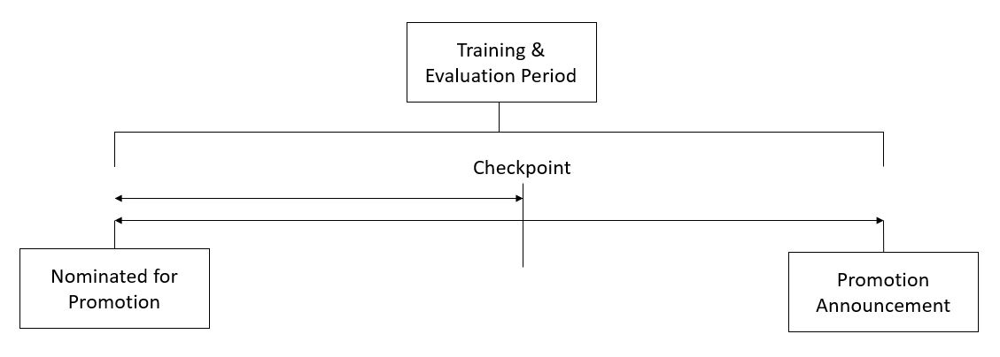

# Logistic-regression
## Задание
Клиент - крупная многонациональная компания, имеющая в организации 9 широких вертикалей. Одна из проблем, с которой 
сталкивается ваш клиент, заключается в том, чтобы правильно определить людей для продвижения по службе  и вовремя их подготовить.
В настоящее время продвижение сотрудника по службе происходит после окончания следующих этапов:

1. Опрределяется набор сотрудников на основе рекомендаци/результатов прошлой работы
2. Отобранные сотрудники проходят отдельную программу обучения и тестирования для каждой вертикали. Эти программы основаны на необходимых навыках каждой вертикали.
3. В конце программы, в зависимости от различных факторов, таких как эффективность обучения, выполнение KPI, 
успешность прохождения собеседования и т.д., сотрудник получает продвижение по службе.

Для вышеупомянутого процесса окончательные предложения объявляются только после прохождения всех этапов, и это приводит к задержке перехода к их новым ролям. 
Следовательно, компании нужна ваша помощь в определении подходящих кандидатов на конкретном контрольном пункте, чтобы ускорить цикл продвижения.

Они предоставили несколько атрибутов, касающихся прошлой и текущей производительности сотрудников, а также демографические данные. 
**Теперь задача состоит в том, чтобы предсказать на контрольной точке, будет ли повышен в должности потенциальный участник после процесса оценки.**

Описание предоставленного набора данных:
Переменная | описание
-----------|------------
employee_id |	Уникальный идентификатор сотрудника
department |	Отдел сотрудника
region |	Регион трудоустройства (неупорядоченный)
education |	Уровень образования
gender |	Пол сотрудника
recruitment_channel |	Канал найма сотрудника
no_of_trainings |	Никаких других тренингов, проведенных в прошлом году по soft skills, техническим навыкам и т. д.
age |	Возраст сотрудника
previous_year_rating |	Рейтинг сотрудников за предыдущий год
length_of_service |	Стаж работы в годах
KPIs_met> 80%	 | Если процент KPI (ключевых показателей эффективности)> 80%, то 1 иначе 0
awards_won? |	Если награды выиграны в прошлом году, то 1 иначе 0
avg_training_score |	Средний балл в текущих тестах
is_promoted	(Target) | Рекомендуется для продвижения

